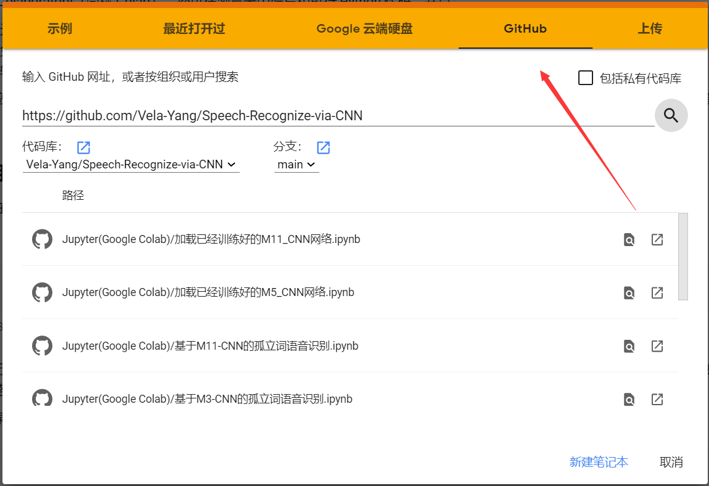
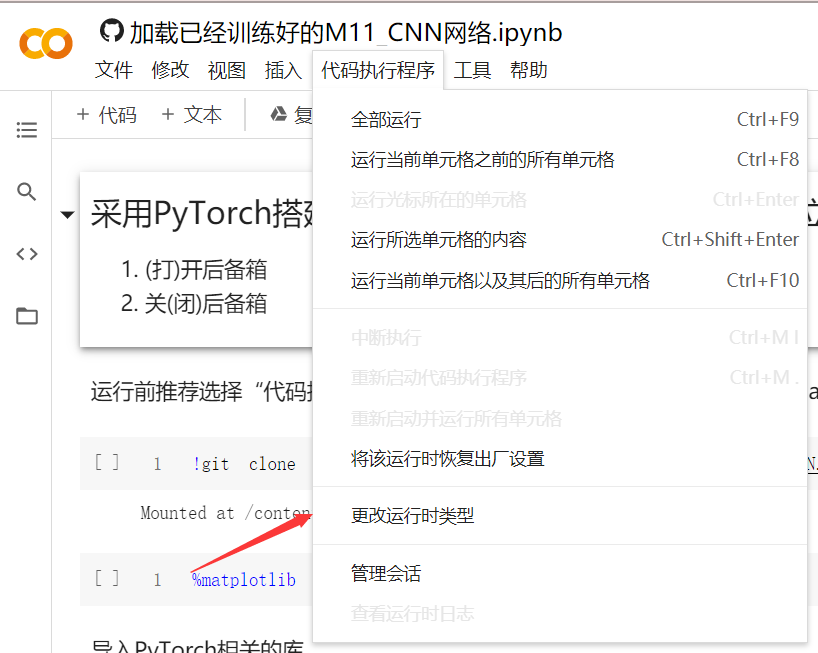
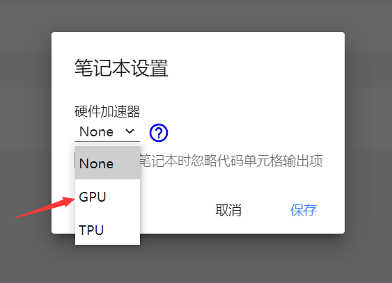
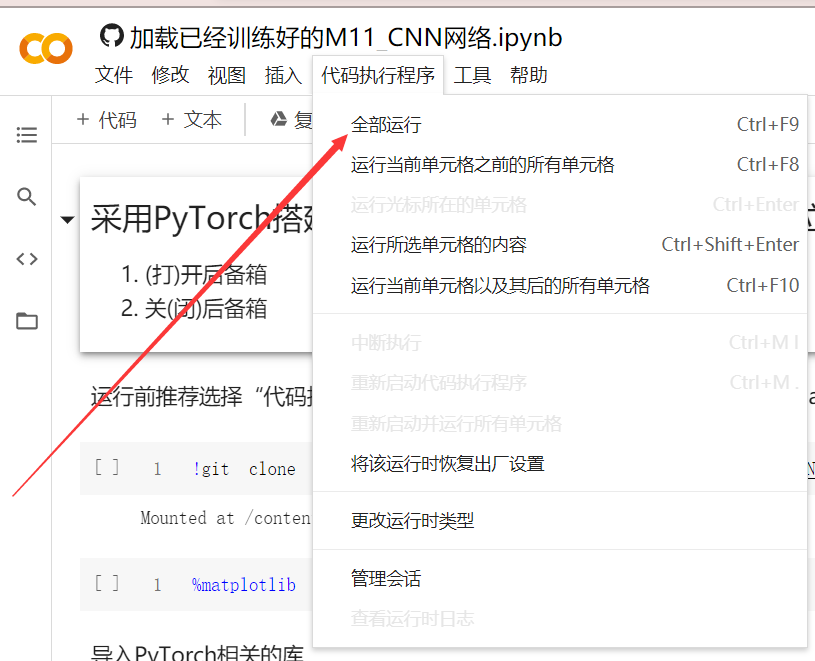

# Isolated-Word-Recognition-via-CNN   
 项目源于[@Vela---Speech-Recognize-via-CNN](https://github.com/Vela-Yang/Speech-Recognize-via-CNN)    
 相对于源项目，主要有以下变化：   
 1. 简化项目结构，现在仅包含一个Jupyter Notebook笔记本与几个python模块和数据集   
 2. 将数据集类MyDataset分离出来，简化代码   
 3. 将M3、M5、M11整合至一个模块[@CNNs.py](./CNNs.py)中，方便使用时调用与调试不同网络

### 基本功能与原先一致。  

# 推荐使用Chromium类浏览器，在Google Colab运行   

# Colab 运行方法  
 ## 1. 打开Colab并登录账号：https://colab.research.google.com
 ## 2. 按下图，红色箭头选择从Github运行笔记本，绿色粘贴地址  

 ## 3. 选择一个笔记本并打开  
 ## 4. 打开“代码执行程序”选项卡，选择更改运行时类型  

 ## 5. 选择“GPU”  

 ## 6. 运行！！！ 

 
